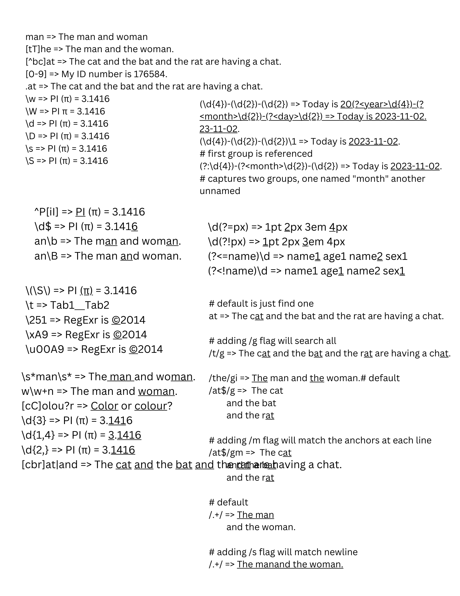

# Learn Regex
Examples based Regex cheatsheet. Examples assumes `/g` flag is on.

- [Character Handling](#character-handling)
  - [basic match](#basic-match)
  - [\[abc\] character set](#abc-character-set)
  - [\[^abc\] negated set](#abc-negated-set)
  - [\[a-z\] range set](#a-z-range-set)
  - [. dot operator](#-dot-operator)
  - [\\w word](#w-word)
  - [\\W not word](#w-not-word)
  - [\\d digit](#d-digit)
  - [\\D not digit](#d-not-digit)
  - [\\s whitespace](#s-whitespace)
  - [\\S whitespace](#s-whitespace-1)
- [Anchors](#anchors)
  - [^ beginning](#-beginning)
  - [$ end](#-end)
  - [\\b word boundary](#b-word-boundary)
  - [\\B not word boundary](#b-not-word-boundary)
- [Escaped characters](#escaped-characters)
  - [\\ reserved character](#-reserved-character)
  - [\\t tab](#t-tab)
  - [others](#others)
  - [octal, hexadecimal, unicode](#octal-hexadecimal-unicode)
- [Quatifiers](#quatifiers)
  - [\* zero or more](#-zero-or-more)
  - [+ one or more](#-one-or-more)
  - [? optional](#-optional)
  - [{} quantifier](#-quantifier)
  - [| alternation](#-alternation)
- [Groups](#groups)
  - [() capturing group](#-capturing-group)
  - [(?\<\>) named capturing group](#-named-capturing-group)
  - [() \\1 group reference](#-1-group-reference)
  - [(?:) non capturing group](#-non-capturing-group)
- [Lookaround](#lookaround)
  - [(?=) positive lookahead](#-positive-lookahead)
  - [(?!) negative lookahead](#-negative-lookahead)
  - [(?\<=) positive lookbehind](#-positive-lookbehind)
  - [(?\<!) negative lookbehind](#-negative-lookbehind)
- [Flags](#flags)
  - [g global search](#g-global-search)
  - [i case insensitive](#i-case-insensitive)
  - [m multiline](#m-multiline)
  - [s dotall](#s-dotall)
- [Greedy vs Lazy Matching](#greedy-vs-lazy-matching)

## Character Handling
### basic match
Matches exact characters.

<pre>
man => The <a href="#x">man</a> and wo<a href="#x">man</a>.
</pre>

### [abc] character set
Matches any character in the set.

<pre>
[tT]he => <a href="#x">The</a> man and <a href="#x">the</a> woman.
[bc]at => The <a href="#x">cat</a> and the <a href="#x">bat</a> and the rat are having a chat.
</pre>

### [^abc] negated set
Matches any character that is not in the set.

<pre>
[^bc]at => The cat and the bat and the <a href="#x">rat</a> are having a c<a href="#x">hat</a>.
</pre>

### [a-z] range set
Matches any character between the the two specified character.

<pre>
[0-9] => My ID number is <a href="#x">176584</a>.
</pre>

### . dot operator
Matches any character except linebreaks.

<pre>
.at => The <a href="#x">cat</a> and the <a href="#x">bat</a> and the <a href="#x">rat</a> are having a c<a href="#x">hat</a>.
</pre>

Equivalent: [^\n\r]

### \w word
Matches any word (alphanumeric and underscore).

<pre>
\w => <a href="#x">PI</a> (π) = <a href="#x">3</a>.<a href="#x">1416</a>
</pre>

Equivalent: [a-zA-Z0-9_]

### \W not word
Matches any non word (not alphanumeric and underscore).

<pre>
\W => PI<a href="#x"> π = </a>3<a href="#x">.</a>1416</a>
</pre>

Equivalent: [^a-zA-Z0-9_]

### \d digit
Matches any digit.

<pre>
\d => PI (π) = <a href="#x">3</a>.<a href="#x">1416</a>
</pre>

Equivalent: [0-9]

### \D not digit
Matches any non digit.

<pre>
\D => <a href="#x">PI (π) = </a>3<a href="#x">.</a>1416
</pre>

Equivalent: [^0-9]

### \s whitespace
Matches any whitespace.

<pre>
\s => PI(π)=3.1416
</pre>

### \S whitespace
Matches any non whitespace.

<pre>
\S => <a href="#x">PI</a> <a href="#x">(π)</a> <a href="#x">=</a> <a href="#x">3.1416</a>
</pre>

## Anchors
### ^ beginning
Matches at the beginning.

<pre>
^P[iI] => <a href="#x">PI</a> (π) = 3.1416
</pre>

Don't be confused with `[^iT]` that means not any of i and I.

### $ end
Matches at the end.

<pre>
\d$ => PI (π) = 3.141<a href="#x">6</a>
</pre>

### \b word boundary
Matches at the end of each word.

<pre>
an\b => The m<a href="#x">an</a> and wom<a href="#x">an</a>.
</pre>

### \B not word boundary
Matches not at the end of each word.

<pre>
an\B => The man <a href="#x">an</a>d woman.
</pre>

## Escaped characters
### \ reserved character
Matches special reserved characters `+*?^$\.[]{}()|/`.

<pre>
\(\S\) => PI <a href="#x">(π)</a> = 3.1416
</pre>

### \t tab
Matches a TAB character.

<pre>
\t => Tab1Tab2
</pre>

### others
<pre>
\n = Matches line feed character 
\v = Matches vertical tab character 
\f = Matches form feed character 
\r = Matches carriage return character 
\0 = Matches null character
</pre>

### octal, hexadecimal, unicode
© in octal is 251
<pre>
\251 => RegExr is <a href="#x">©</a>2014
</pre>

© in hexadecimal is A9
<pre>
\xA9 => RegExr is <a href="#x">©</a>2014
</pre>

© in unicode is 00A9
<pre>
\u00A9 => RegExr is <a href="#x">©</a>2014
</pre>

## Quatifiers
### * zero or more
Matches 0 or more of the preceding character.

<pre>
\s*man\s* => The<a href="#x"> man </a>and wo<a href="#x">man</a>.
</pre>

### + one or more
Matches 1 or more of the preceding character.

<pre>
w\w+n => The man and <a href="#x">woman</a>.
</pre>

### ? optional
Matches 0 or more of the preceding character.

<pre>
[cC]olou?r => <a href="#x">Color</a> or <a href="#x">colour</a>?
</pre>

### {} quantifier
Matches the specific quantity of the preceding character.  
{3} = matches exactly 3  
{1,3} = matches 1 to 3  
{3,} = matches 3 or more  

<pre>
\d{3} => PI (π)</a> = 3.<a href="#x">141</a>6
\d{1,4} => PI (π)</a> = <a href="#x">3</a>.<a href="#x">1416</a>
\d{2,} => PI (π)</a> = 3.<a href="#x">1416</a>
</pre>

### | alternation
Acts like an OR statment. Matches at expression level unlike []

<pre>
[cbr]at|and => The <a href="#x">cat</a> <a href="#x">and</a> the <a href="#x">bat</a> <a href="#x">and</a> the <a href="#x">rat</a> are having a chat.
</pre>

## Groups
### () capturing group
Groups characters and captures (stores) for futher processing.

<pre>
(\d{4})-(\d{2})-(\d{2}) => Today is <a href="#x">2023-11-02</a>.
</pre>

### (?<>) named capturing group
Tags a group nam for the groups for futher processing.

<pre>
(?&lt;year&gt;\d{4})-(?&lt;month&gt;\d{2})-(?&lt;day&gt;\d{2}) => Today is <a href="#x">2023-11-02</a>.
</pre>

### () \1 group reference
Matches the given group number only.

<pre>
(\d{4})-(\d{2})-(\d{2})\1 => Today is <a href="#x">2023-11-02</a>.
# first group is referenced 
</pre>

### (?:) non capturing group
Groups characters but doesn't capture.

<pre>
(?:\d{4})-(?&lt;month&gt;\d{2})-(\d{2}) => Today is <a href="#x">2023-11-02</a>.
# captures two groups, one named "month" another unnamed
</pre>

## Lookaround
### (?=) positive lookahead
Get all the matches that are followed by a specific pattern.

<pre>
\d(?=px) => 1pt <a href="#x">2</a>px 3em <a href="#x">4</a>px
</pre>

### (?!) negative lookahead
Get all the matches that are not followed by a specific pattern.

<pre>
\d(?!px) => <a href="#x">1</a>pt 2px <a href="#x">3</a>em 4px
</pre>

### (?<=) positive lookbehind
Get all the matches that are preceded by a specific pattern.

<pre>
(?&lt;=name)\d => name<a href="#x">1</a> age1 name<a href="#x">2</a> sex1
</pre>

### (?<!) negative lookbehind
get all the matches that are not preceded by a specific pattern.

<pre>
(?&lt;!name)\d => name1 age<a href="#x">1</a> name2 sex<a href="#x">1</a>
</pre>

## Flags
### g global search
Find all matches unlike stopping after the first match.

<pre>
# default is just find one
at => The c<a href="#x">at</a> and the bat and the rat are having a chat.

# adding /g flag will search all
/t/g => The c<a href="#x">at</a> and the b<a href="#x">at</a> and the r<a href="#x">at</a> are having a ch<a href="#x">at</a>.
</pre>

### i case insensitive
Case insensitive search.

<pre>
/the/gi => <a href="#x">The</a> man and <a href="#x">the</a> woman.
</pre>

### m multiline
Apply anchors(^ $ \b \B) at each line.

<pre>
# default
/at$/g =>  The cat
        and the bat
        and the r<a href="#x">at</a>

# adding /m flag will match the anchors at each line
/at$/gm =>  The c<a href="#x">at</a>
        and the b<a href="#x">at</a>
        and the r<a href="#x">at</a>
</pre>

### s dotall
Dot (.) will match any character, including newline.

<pre>
# default
/.+/ => <a href="#x">The man</a>
        and the woman.

# adding /s flag will match newline
/.+/ => <a href="#x">The man</a>
        <a href="#x">and the woman.</a>

</pre>

## Greedy vs Lazy Matching
Default is greedy, that matches as many characters as possible.  

<pre>
.+at => <a href="#x">The cat and the bat and the rat are having a chat</a>.
</pre>

Lazy makes is as few as possible.

<pre>
.+?at => <a href="#x">The cat</a> and the bat and the rat are having a chat.
</pre>